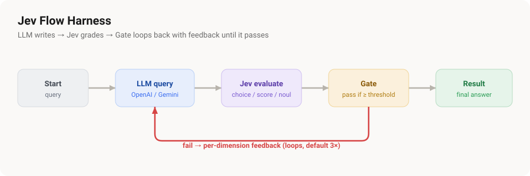

# Jev Flow Harness

A standalone local tool to prototype TypeSafe's **Jev** model for the watch — a
drag-and-drop **node editor** where you wire an LLM to Jev evaluators, gate on a
threshold, and loop until the answer passes. **Touches no firmware.**

## Why it's a local Node app (not a browser/device app)

`api.typesafe.ai`, OpenAI, and Gemini all refuse browser calls (no CORS headers),
so a plain web page can't reach them. This app calls them **server-side** — the
same way the ESP32 firmware would — so there's no CORS problem, and your API keys
go only from this localhost process to each provider over TLS (never through the
browser or any third party).

## Run

```bash
node server.js
```

Then open http://localhost:7878, paste your two keys (LLM + Jev) up top, click
**Save keys**, pick a preset, and hit **Run**. Zero npm dependencies (Node's
built-in `http`/`https`/`fs` only).

## The blocks

Drag from the **Add** row; connect an output dot to an input dot to wire them.

- **Start** — the initial query / state.
- **LLM query** — calls OpenAI or Gemini. Input 1 = query, input 2 = feedback (for retries). Keeps a real conversation across retries so it *revises* rather than regenerating zero-shot. The provider/model you last ran with is remembered.
- **Jev choice / score / noul** — evaluate the incoming text. Each shows a hint of what its 0–1 **gate value** means:
  - **Score** — normalized rubric (a live legend shows e.g. `0.00 poor · 0.50 okay · 1.00 excellent`).
  - **Noul** — 0 (false) → 1 (true).
  - **Choice** — gate on: *chose the target option* (1/0), *probability of an option*, or *confidence*. In confidence mode, setting a **Target** makes it count only when it actually chose that target (a confident wrong pick scores 0).
- **Gate** — `pass if value ≥/>/≤/< threshold`. Wire **several** Jev blocks into one Gate and combine them (**all must pass** or **average passes**). Out 1 = pass, out 2 = fail. Default **max iterations = 3**.
- **Result** — the final answer.

## The refine loop

Wire the Gate's **fail** output back into the LLM's **feedback** input. On a fail
the Gate builds a **per-dimension critique** (which Jev blocks fell short and by
how much), which is fed to the LLM as the next conversation turn. It loops until
the Gate passes or hits max iterations.

## Presets (dropdown)

- **Refine loop (score-gated)** — LLM → Jev score → Gate → loop.
- **Refine loop (multi-dimension)** — LLM → 3 Jev scores (clarity/completeness/accuracy) → one Gate (all must pass) → loop. The version that converges.
- **Guardrail check / Replay match / Intent routing / KB curation** — single `Start → Jev → Result` evaluations of a fixed state (no LLM, no loop).

## Controls

- **Step** (checkbox, off by default) — run one iteration per click; the button becomes **Continue** between iterations until pass or max.
- **Hide log** — collapse the run panel (canvas widens).
- **Save graph / Load graph** — persist the current graph (localStorage).
- **Theme** — light / dark / match-device.

## Run log

Each iteration starts with a bold **ITERATION N** banner. Within it: the exact
feedback sent to the LLM, its answer, each Jev score, and the Gate result
(**PASS** green / **FAIL** red). The feedback is also shown on the LLM node.

## API shapes (reference)

Jev — `POST https://api.typesafe.ai/v1/systemone`, `Authorization: Bearer <key>`
`{ state, model: "jev-latest", questions: { name: { type: "choice|score|noul", instructions, criteria } } }`
- `choice` → `criteria` = `{option: description}`; returns `choice` + `probabilities` + `confidence`
- `score` → `criteria` = array of rubric levels; returns `score` + `probabilities` + `confidence` + `legend`
- `noul` → no `criteria`; returns `noul` (0–1)

LLM (via this app's `/llm` proxy) — OpenAI `chat/completions` or Gemini
`generateContent`, with the full message history passed for multi-turn revision.

## Note

This runs on your **computer**, not the watch — the ESP32 can't run Node. It's a
sandbox to design Jev prompts/questions before writing firmware. Real device use
would call these same APIs from C++ in the sketch (no CORS there either).
